<div align="center">


4th-year **Intelligent Systems Engineer** at Helwan National University.
I build systems end to end — from **register-level firmware** on bare metal, to **neural networks** that see and reason, to **production web platforms** running on the cloud.


<br><br>

<!-- TERMINAL SCREEN START -->
<table style="border-collapse: collapse; width: 640px;">
  <tr>
    <td align="left" bgcolor="#1A1B26" style="padding: 12px; border-radius: 8px;">
      <br>
      
    </td>
  </tr>
</table>
<!-- TERMINAL SCREEN END -->

</div>

---

## ⚙️ Core Engineering Stack

<div align="center">

#### 🔩 Embedded Systems & IoT


#### 🧠 Machine Learning & Deep Learning


#### 🤖 LLMs, RAG & Generative AI


#### 👁️ Computer Vision


#### 🌐 Web & Full-Stack


#### 🗄️ Databases


#### ☁️ Cloud Services & DevOps


#### 🛠️ Tooling & AI-Assisted Development


</div>

---

## 🚀 Featured Architecture & Projects



<div align="center">

### ⚜️ El-Salam Scouting Group — Web Portal & AMS
**A production association-management system serving 400+ scout profiles.**

</div>

Two products in one codebase: a high-performance public landing page acting as the group's digital business card, and a secure, role-gated internal dashboard where troop leaders manage scout records, attendance, and digitized administrative archives.

* **Architecture** — Next.js App Router with server components, `server-only` data access, and a proxy layer that keeps every secret off the client.
* **Data & Auth** — Supabase (PostgreSQL) with Row Level Security policies enforcing admin / leader / scout permission tiers, plus invite-code onboarding.
* **Media Pipeline** — Cloudinary for camp gallery storage, transformation, and delivery.
* **Delivery** — Deployed on Vercel, with GitHub Actions CI running on every push.

<div align="center">


</div>

<br>

| Project | Description | Tech Stack |
| :--- | :--- | :--- |
| **[🏠 SmartHome OS v1.0](#)** | Custom home-automation firmware written from scratch — register-level manipulation, hand-rolled hardware drivers, and a safety-critical architecture with no vendor abstraction layers. | `C` · `ATmega32` · `Bare-Metal` · `UART/SPI/I2C` |
| **[👁️ SmartVision AI Navigation](#)** | AI navigation assistant for visually impaired users. Real-time object detection interprets the surroundings and turns them into actionable guidance. | `Python` · `YOLOv8` · `OpenCV` · `Transfer Learning` |
| **[📡 Defense Radar Simulation](#)** | *(In Development)* 3D-printed radar system model fused with AI-driven detection — hardware mechanics meeting software signal processing. | `C++` · `Hardware Design` · `Sensors` |
| **[⚜️ SSG Web Portal & AMS](#)** | Full-stack portal + association management system for 400+ scouts, with RLS-secured multi-role auth and a cloud media pipeline. | `Next.js` · `TypeScript` · `Supabase` · `Vercel` |

---

## 🎓 Training & Certifications

<div align="center">

| Program | Issuer |
| :--- | :--- |
| 🧠 **Machine Learning & Deep Learning** | Huawei ETA — Egypt Talent Academy |
| 🤖 **Artificial Intelligence Specialization** | National Telecommunication Institute (NTI) |
| 🌿 **Git & GitHub** | Almdrasa |

<br>

<!-- Replace the # with your LinkedIn certifications URL, e.g. https://www.linkedin.com/in/<you>/details/certifications/ -->
<a href="#"></a>

</div>

---

## 🔭 Currently

```yaml
building:      El-Salam SSG portal + AMS (Next.js · Supabase · Vercel)
learning:      RAG pipelines, LLM application architecture, vector retrieval
exploring:     AI-assisted development with Claude Code & Antigravity
seeking:       Summer 2026 internships — Embedded / AI / Full-Stack
ask_me_about:  bare-metal C, YOLO training runs, Postgres RLS
```

---

## 📊 System Telemetry

<div align="center">


<br>


<br><br>


<br>


</div>

---

## 📡 Connect

<div align="center">

<!-- Replace the # below with your real LinkedIn URL and mailto: address -->
<a href="#"></a>
<a href="#"></a>
<a href="https://github.com/joe02692"></a>

<br><br>


</div>
